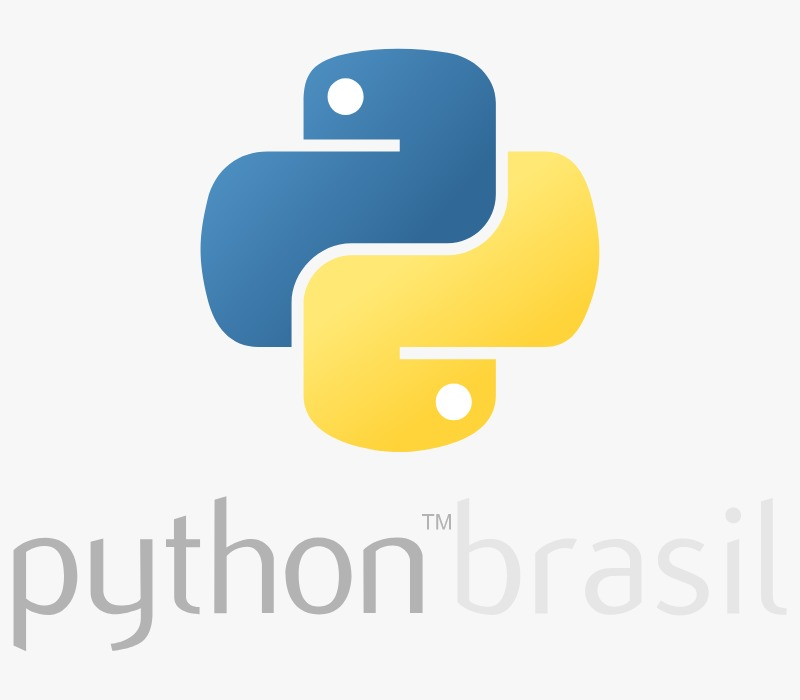

<h1 align="center">Python Brasil</h1>

<section align="center">
  
</section>

###

**Lista de Exercícios do Python Brasil**

* 1_estruturas_sequencial ✔️
* 2_estrutura_de_decisao ✔️
* 3_estrutura_de_repeticao ✔️
